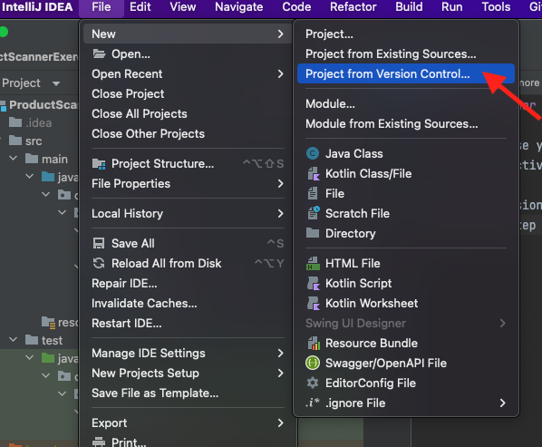
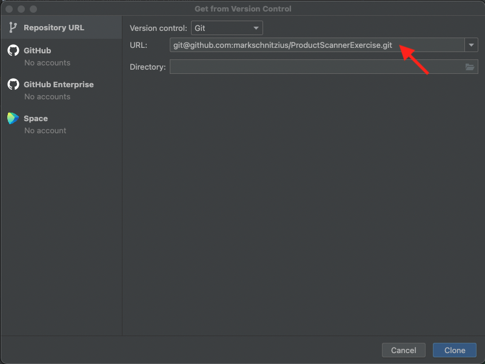
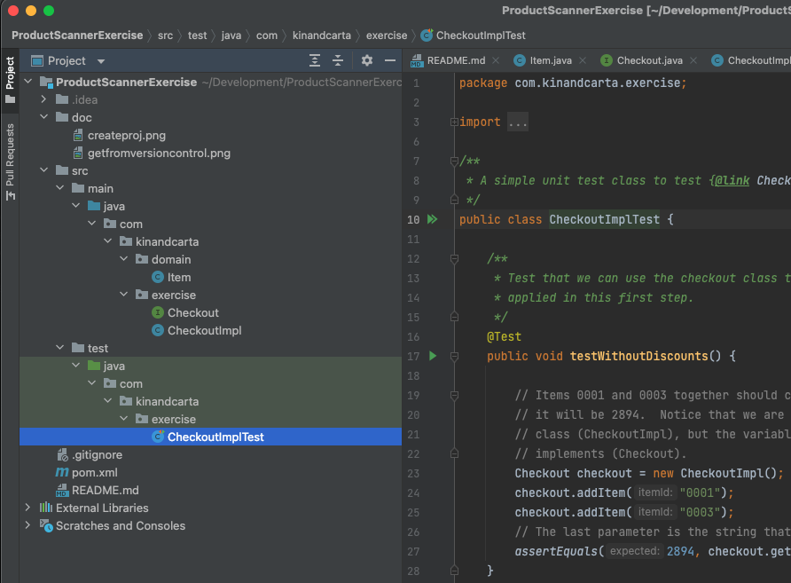
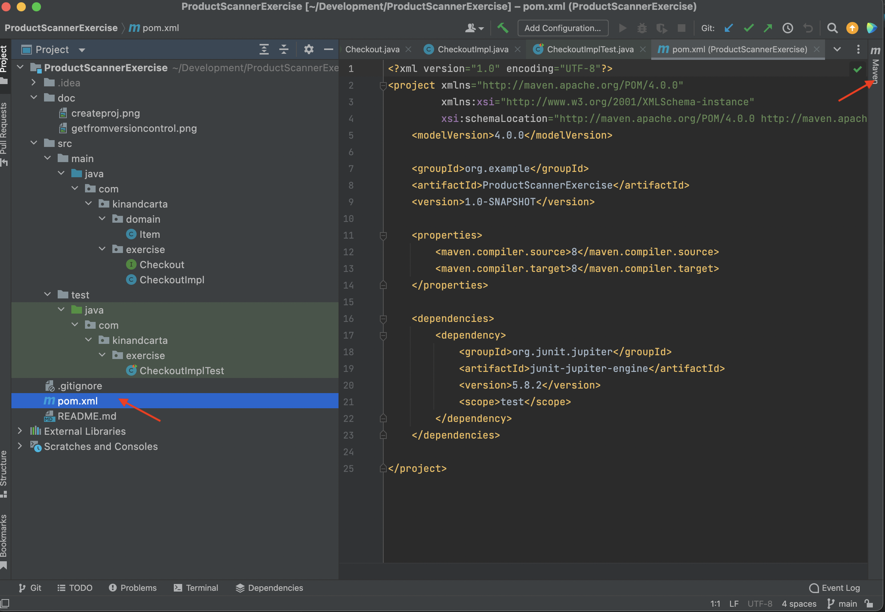
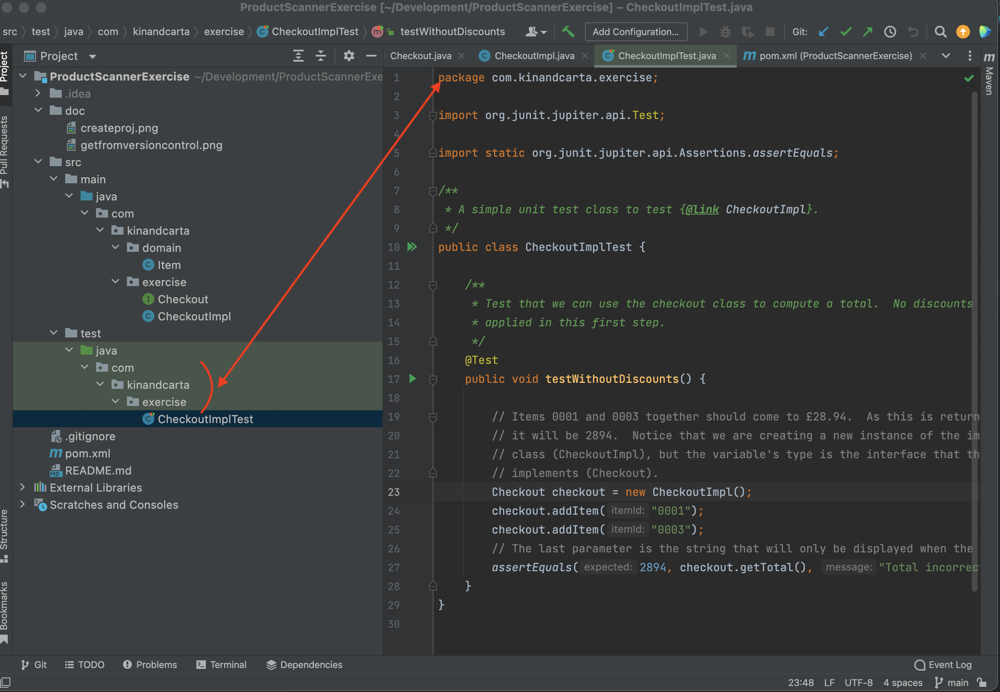
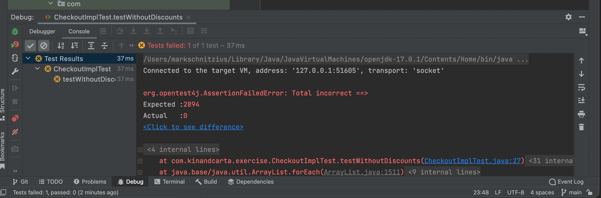

## Product Scanner exercise

In this exercise you will implement the Product Scanner exercise described in the
"Learning Objectives - Hello Java!" section of the wiki.

### Intellij setup

A skeleton version of the project has been set up on Github at `git@github.com:markschnitzius/ProductScannerExercise.git`.
So you can create the project by selecting "File | New | Project from Version Control":

And paste in the github URL:

You'll need to also give it the directory where you want to save the project locally.
After clicking Clone, you should be able to view the project structure in the Project
view pane on the left.  Click around and have a look:

If you see red anywhere in the Project pane or in the files themselves, it means
something hasn't been configured properly.  Most likely it means you haven't
installed Java, or Intellij doesn't know where it is.  We won't go into all the
possible configuration problems here; it's probably best to asked for help if you're
seeing these errors.

### Maven

This project uses a build automation tool called Maven that is widely used for project management.
Using Maven, you can

* Configure the project Java version, project structure, properties, etc.
* Define which external libraries are used by the project.
* Set up tasks to execute the code, run tests, etc.

Maven is configured by placing a pom.xml file at the top level of the project.  Have a look
at the one that's included, and special Maven panel that Intellij provides when it sees that
your project uses Maven:

### The first exercise

For the first exercise, the goal is just to get the included unit test to pass!  Let's have
a look at the test file.  Select it in the left hierarchy:

You might notice that the 'package' statement at the top of the file matches the last part
of the file's directory hierarchy:

This is not a coincidence.  Java uses this packaging as namespacing, so that you can have
classes of the same name as long as they live in different packages (directories), and the
package defined for a class must always match that directory hierarchy.

#### Debugging the test

In Intellij you can either 'run' or 'debug' test classes.  Running them means they will
run straight through without stopping; debugging them means they will stop at any breakpoints
you define and let you look closer.  Debugging may be marginally slower, but in general it
never hurts to just use the debug option always, even if you haven't defined any breakpoints.

Intellij provides lots of ways that you can debug the test.  You can

* use the Maven panel to execute the "Lifecycle | test" target (right click it and select 'Debug...')
* right click on any package in the Project view and select 'Debug...', which will debug all tests under that package
* click the green double-arrow beside the test class name in the file view and select 'Debug...'
* click the green single arrow beside the test method name and select 'Debug...'

Let's do that last option:

It may take a moment to compile and execute the test (watch the status bar at the very bottom of the
Intellij window).  But then you should see a test failure:

This failure occurs because we've only stubbed out the class that's being tested (CheckoutImpl).  Your job is to
add the 'guts' to that class, so that this test will pass!

### Bonus points

If you've gotten this far, well done!  But if that was a bit too easy, here are a few enhancements you might want
to consider:

* Checkout is a Java interface, but its implementation is a Java class.  We could also define an interface for the Item class -- this would allow us to define other kinds of items with additional fields.
* The Checkout class allows you to add item ids to the basket individually, but the original problem definition shows an example where a list of items is accepted.  So add another method that takes a collection of items ids and adds them all to the basket.
* You could also make the method accept a variable number of arguments -- see [Java varargs](https://www.baeldung.com/java-varargs) for more details.
* The CheckoutImpl#getTotal method computes the total each time you call it.  Make it save the total to a new field the first time, then just return that field every time it is called afterwards.
* 